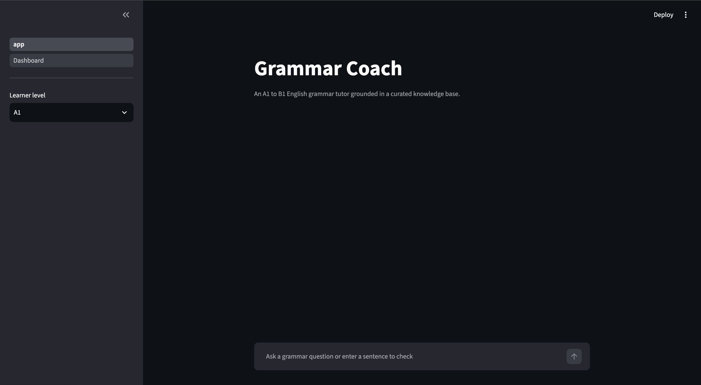
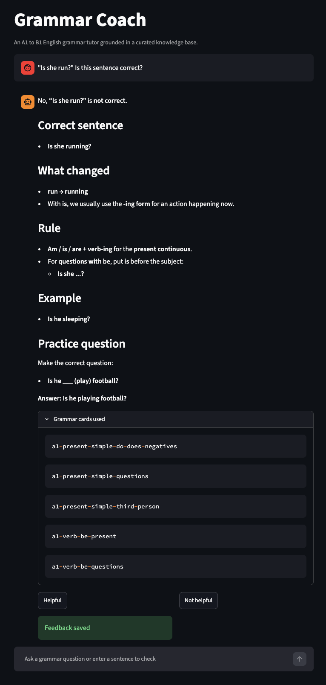
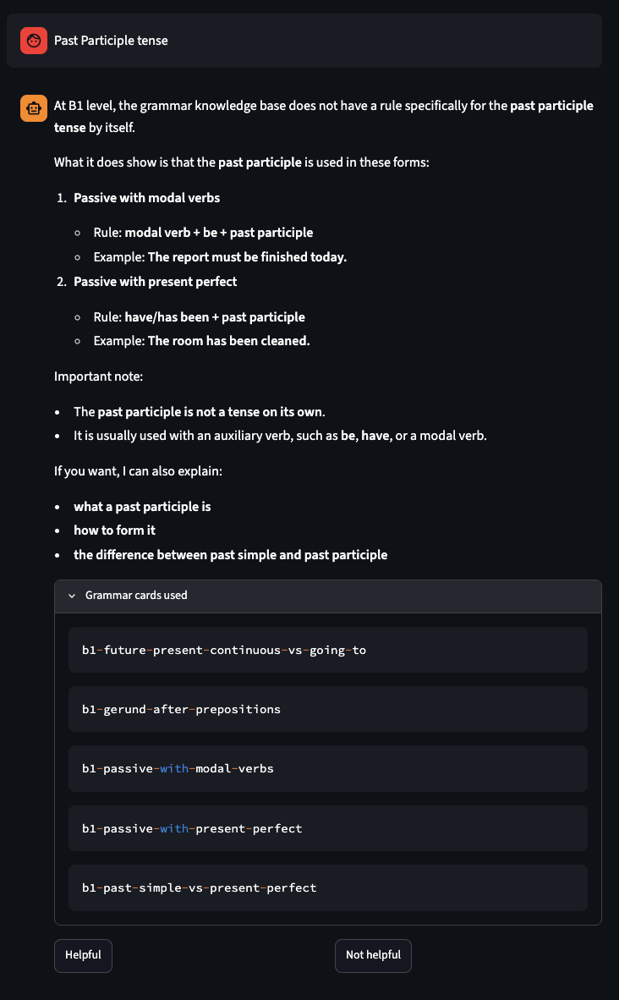
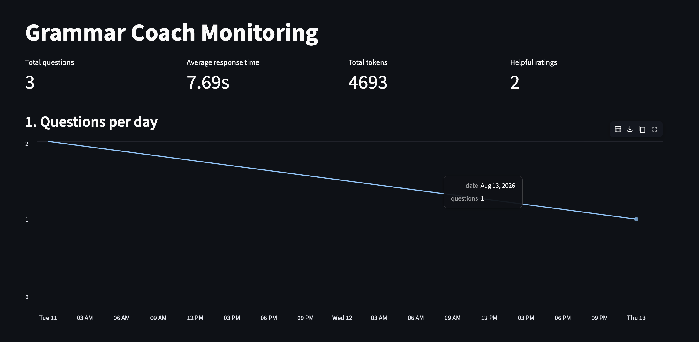
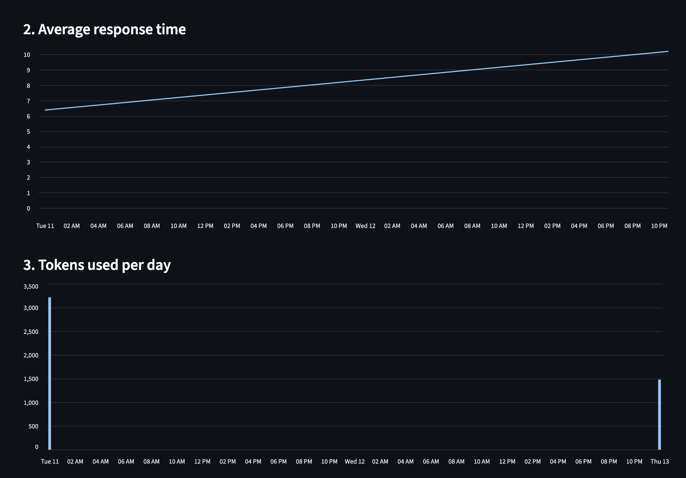
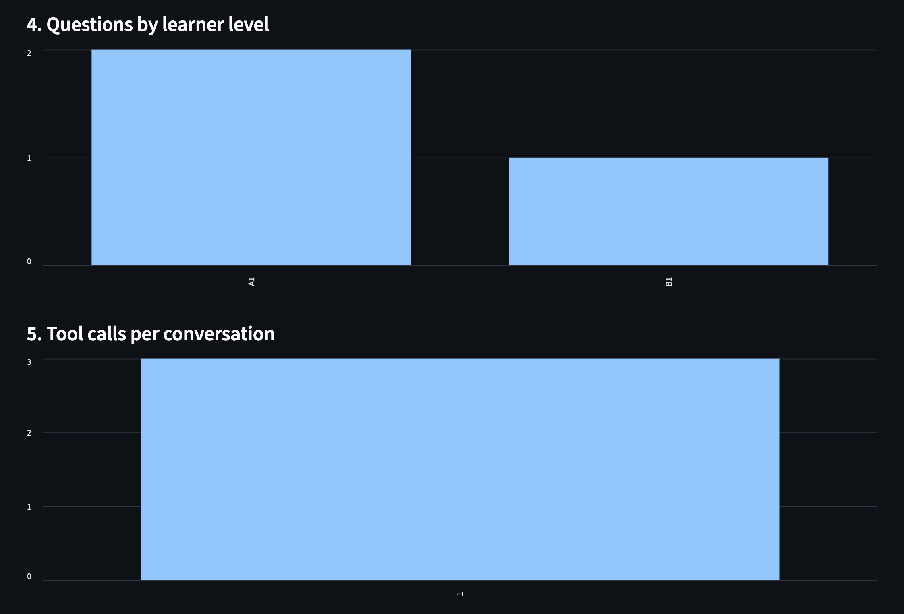
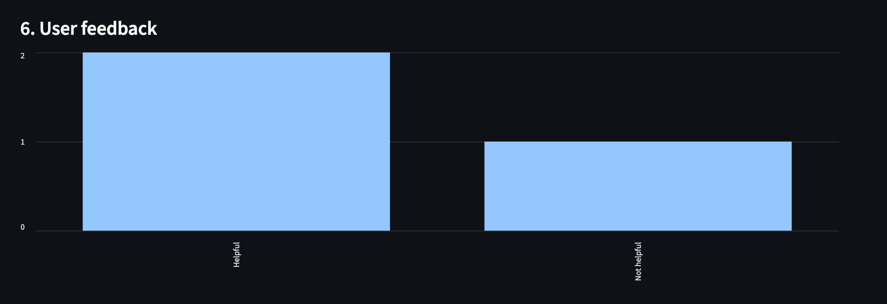

# Grammar Coach
An Agentic RAG application designed to help adult English learnings at CEFR levels A1 to B1 to understand basic grammar rules, correct sentences and practice common grammar mistakes.

## Problem description

English learners often know that a sentence sounds incorrect but do not understand the grammar rule behind the error. General-purpose language models can provide explanations, but their responses are not necessarily grounded in a controlled learning resource and may be inconsistent with the learner's proficiency level.

Grammar Coach addresses this problem by combining a curated English grammar knowledge base with retrieval-augmented generation. Before answering grammar questions or correcting sentences, the system searches the knowledge base for relevant grammar rules and provides those rules to the language model.

The project focuses on adult learners between CEFR A1 and B1 levels. The objective is to provide concise, grounded grammar explanations while also demonstrating an end-to-end agentic RAG system with retrieval evaluation, answer evaluation, monitoring, feedback, and containerisation.

## Intended users
Adult english learners at CEFR levels: A1, A2 and B1.

## Features
-Ask basic grammar and english questions
-Submit sentences for grammar correction
-Display grammar cards used to generate an answer
-Retrieve explanations from a curated grammar knowledge base
-Collect Helpful/Not Helpful user feedback
-Track response latency, token usage, tool calls, and learner level
-Monitor application usage through a Streamlit dashboard
-Run locally or through Docker

## Project architecture
The project is an agentic RAG. The streamlit interface collects user's question and CEFR level. The OpenAI agent decides when to call the `search_grammar_rules` function. The retrieval layer searches the grammar knowledge base and returns relevant grammar cards.

The agent then produces a grounded response based on the retrieved information. Token usage, response time, retrieved sources, and feedback, is stored in SQLite and displayed through a monitoring dashboard.

## Knowledge base
Structured Grammar Cards stored in: data/grammar_rules.csv

Each grammar card depicts one grammar concept and contains:

- ID
- CEFR level
- category
- topic
- title
- grammar rule
- explanation
- correct examples
- incorrect example
- corrected example
- reason for the error
- retrieval keywords

## Data generation and validation
Total cards: 64

B1: 20, 
A2: 29,
A1: 15

The grammar cards are generated with the help of AI.
The generated grammar cards were then reviewed for:
- duplicate IDs
- duplicate topics
- missing values
- grammar correctness
- appropriate CEFR level
- validity of incorrect/corrected example pairs

## Retrieval methods

### Keyword retrieval
Keyword retrieval uses minsearch for indices.

Different grammar fields are assigned different weights. Fields such as the title, rule, keywords, and incorrect examples are given higher importance so that learner questions and common mistakes can retrieve the most relevant grammar cards.

### Vector retrieval

Semantic retrieval uses OpenAI `text-embedding-3-small` embeddings together with `minsearch.VectorSearch`.

Grammar cards are embedded ahead of time and stored in:

`data/grammar-document-embeddings.npy`

### Hybrid retrieval

Hybrid retrieval combines keyword and vector search using Reciprocal Rank Fusion (RRF).

Both retrieval methods return ranked lists of grammar cards, and RRF combines their rankings to produce the final result.

## Retrieval evaluation

Retrieval quality was evaluated using a ground-truth dataset of learner questions with known relevant grammar-card IDs.

Two metrics were used:

- Hit Rate: whether the expected grammar card appears in the retrieved results
- Mean Reciprocal Rank (MRR): how highly the expected grammar card is ranked

| Retrieval Method | Hit Rate   | MRR        |

| Keyword          | 0.9621     | 0.8017     |
| Vector           | 1.0000     | 0.9365     |
| Hybrid           | 1.0000     | 0.8944     |

Vector search has the highest MRR and a perfect Hit Rate on the evaluation set.

## Answer evaluation

## Agent tools

-External tool named `search_grammar_rules`: Searches the English grammar knowledge base for relevant grammar cards.

The agent is instructed to use this tool before explaining grammar rules or correcting learner sentences. If the first search is unsuccessful, the agent may reformulate the query and search again.

The agent loop is limited to three steps to control latency and API usage. (max_steps=3)

## Monitoring and feedback

Application interactions are stored locally in SQLite.

Users can rate answers as "Helpful" or "Not Helpful". Feedback is linked to the corresponding conversation ID.

The Streamlit monitoring dashboard contains:
1. Questions per day
2. Average response time
3. Token usage per day
4. Questions by learner level
5. Tool calls per conversation
6. User feedback

## Project structure
'''text
llm-project/
├── app.py                             
├── Dockerfile                         
├── docker-compose.yaml                
├── pyproject.toml                     
├── uv.lock                           
├── .python-version                                       
├── .gitignore
├── .dockerignore
│
├── data/
│   ├── grammar_rules.csv              
│   ├── grammar-document-embeddings.npy
│   ├── evaluation-question-embeddings.npy
│   ├── ground-truth-retrieval.csv
│   ├── retrieval-keyword-experiments.csv
│   ├── retrieval-method-comparison.csv
│   └── rag-answer-evaluation.csv
│
├── src/
│   ├── __init__.py
│   ├── agent.py                       
│   ├── retrieval.py                   
│   ├── knowledge_base.py              
│   ├── rag.py                         
│   └── db.py                          
│
├── pages/
│   └── 1_Dashboard.py                 
│
├── code.ipynb                         
├── main.py                            
└── README.md
'''
## Local installation

To run this agent, you will need:
- Python 3.14+
- uv
- OpenAI API key

git clone link: https://github.com/NiaNwe/llm-project.git

## Environment variables

OPENAI_API_KEY=your_openai_api_key
OPENAI_MODEL=gpt-5.4-mini
RETRIEVAL_METHOD=vector
RETRIEVAL_TOP_K=5

## Screenshots

### Grammar Coach UI

### Agent Result

### Monitoring Dashboard

## Known limitations
- The knowledge base currently covers grammar only from CEFR A1 to B1 and some B1-B2 level grammar patterns are not included.
- Retrieval quality depends on the coverage and accuracy of the curated grammar cards.
- Vector retrieval requires an OpenAI embedding API call for new user queries.
- Conversation history is session-based rather than tied to persistent user accounts.
- LLM-based evaluation is useful for comparison but is not equivalent to expert linguistic review.

## Future improvements
- Expanding the knowledge base to B2, C1, and C2
- Identifying recurring grammar mistakes by learner
- Adding adaptive exercise generation
- Adding pronunciation or speech support
- Deploying the application to a cloud platform
- Conducting evaluation with human English-language educators
